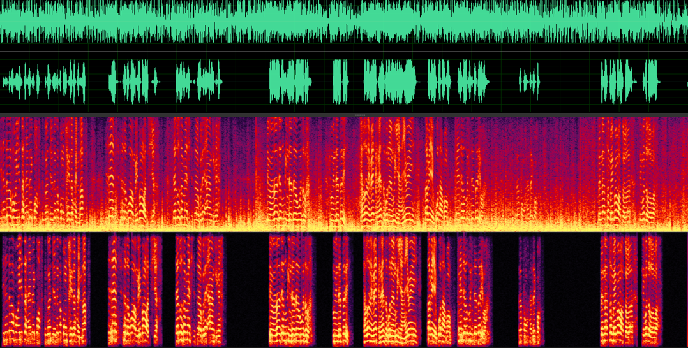
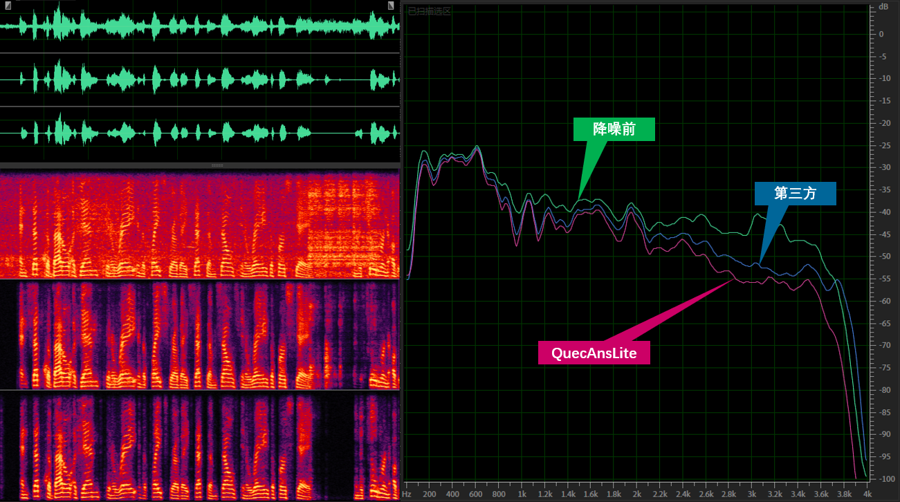
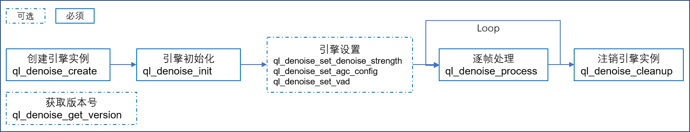

# QuecAns-Lite单通道语音降噪引擎用户开发手册

## 1 能力简介

* 流式单通道语音降噪套件，主要包括以下功能：

| 功能点       | 默认配置 | 默认参数                               | 说明                                                                                                                                                                                  |
| ------------ | :------: | :------------------------------------- | ------------------------------------------------------------------------------------------------------------------------------------------------------------------------------------- |
| 平稳降噪     |   开启   | 降噪强度: 0.5                          | 可有效去除环境中的大部分平稳噪声；<br />参数可设置范围[0, 1]，值越大降噪强度越大；                                                                                                    |
| 非平稳降噪   |   开启   | 降噪强度: 0.5                          | 可有效去除环境中的大部分非平稳噪声；<br />参数可设置范围[0, 1]，值越大降噪强度越大；                                                                                                  |
| 人声检测     |   关闭   | /                                      | Voice Activity Detection: 检测人声段落的起始点和结束点；<br />检测当前帧的“语音/非语音"状态；<br />注意：开启VAD后，为确保VAD的准确性，会缓存一定长度的数据，也因此带来更大的延迟； |
| 自动增益控制 |   开启   | 满量程分贝: -3dBFS<br />强制限幅: 开启 | Automatic Gain Control: 控制输出音频能量的动态范围在一个合理的区间，避免能量忽高忽地的情况出现；                                                                                      |

* 以风噪场景为例，所有功能全开，降噪前（上)和降噪后（下)的音频波形和语谱图对比如下图所示，可以看到绝大部分风噪被有效去除，同时人声得到很好的保留。



* 与第三方（某商业语音服务供应商在同等算力级别下的降噪库)在某条音频上的降噪效果对比，原始降噪前波形和语谱图在最上，中间为第三方降噪后，最下为本降噪引擎的降噪效果，如下图所示，从语谱图可以看到本降噪算法在人声得到完好保留的同时，降噪量明显优于第三方算法库。



* 与第三方降噪在内部测试集上的客观评测指标对比，结果如下表所示：

| 指标项 | 原始带噪语音 | 第三方降噪 | QuecAnsLite | 指标说明                                                                                                                                                                                       |
| :-----: | :----------: | :--------: | :---------: | ---------------------------------------------------------------------------------------------------------------------------------------------------------------------------------------------- |
| PESQ-NB |    2.278    |   2.301   |    2.577    | 感知语音质量评估，由国际电信联盟（ITU）提出，用于评估语音信号的质量，该算法通过模拟人类听觉系统的反应来预测人们对语音质量的主观评价；<br />其得分范围在(-0.5, 4.5)之间，越高表示语音质量越好； |
|  STOI  |    0.861    |   0.810   |    0.843    | 短时客观可懂度，用来衡量语音的清晰度和可懂度；<br />值介于0到1之间，数值越接近1表示语音信号的可懂度越高；                                                                                      |
| SegSNR |    4.835    |   5.794   |    5.500    | 分段信噪比，用于衡量降噪后语音信号相对于噪声的倍数关系，其值越高，表示降噪后的噪声越少；                                                                                                       |
|  SISDR  |    7.446    |   6.564   |    8.300    | 尺度不变信号失真比，用于衡量估计信号与参考信号之间的失真程度，其值越高，表示估计信号与参考信号之间的差异越小，即语音质量越好；                                                                 |

## 2 引擎特性

### 2.1 数据输入格式要求

| 编码格式 | 采样频率 | 帧长 | 通道数 | 位宽  | 大小端 |
| :------: | :------: | :--: | :----: | ----- | ------ |
|   PCM   |  8000Hz  | 10ms |   1   | 16bit | 小端   |

### 2.2 资源占用与性能

| 硬件平台 | 操作系统 | ROM(KB) | RAM(KB) | HEAP(KB) | RTF  |
| -------- | :------: | :-----: | :-----: | :------: | ---- |
| ASR1606  |   RTOS   |   120   |   81   |    39    | 0.65 |

## 3 授权说明

支持【在线激活】和【工具授权】

* **在线激活**：在首次使用时，需要将设备联网，SDK初始化时获取授权license激活。设备激活后，即可在无网环境下使用。如果有恢复出厂设置或清空应用缓存等操作，将license清除后，算法将无法正常使用，将设备联网重启应用即可恢复。适用于设备可联网场景，激活过程简单。
* **工具授权**：移远RTOS平台下可以通过移远授权工具，在PC上通过串口连接设备进行授权，授权后再次烧录工厂包固件或者烧录时选择全擦授权将会失效，需要重新授权。

## 4 兼容性说明

| 类别 | 兼容平台                                            |
| ---- | --------------------------------------------------- |
| 系统 | 支持Android、移远RTOS平台                           |
| 机型 | 搭载Android的设备或者移远RTOS平台均可使用           |
| 网络 | Android设备必须具备联网条件，移远RTOS平台不要求联网 |

## 5 SDK包组成

### 5.1 Android平台

SDK中包含Android Demo APK、可执行文件、Demo、动态库、JNI接口。集成前，请先测通可执行文件确定环境可运行该算法，再通过Demo以及文档了解原理。如果您自己代码过于复杂，可以使用一个helloworld项目了解集成过程。

* Android Demo APK：Android设备的demo Apk，可以直接安装在Android设备进行试用体验
* 可执行文件：Android可执行文件，可直接调用进行环境测试以及性能 测试
* Demo：算法相关的调用逻辑demo，开发时可参照demo
* 动态库：Android 32\64位的动态库，开发时通过链接使用该算法
* JNI接口：如需集成在Android APK上，可参照该JNI接口进行使用

### 5.2 移远RTOS平台

算法已集成在对应平台的SDK包内核侧中，不需要自行移植，可直接参考平台SDK中的demo进行使用。

**注意：ASR 1606平台中代码直接嵌合在内核侧，不需要再重复调用降噪算法的api！！！**

## 6 接口调用流程

### 6.1 接口介绍

#### 6.1.1 创建引擎实例

```
void *ql_denoise_create(void);
```

* [out] return: 返回引擎实例，非NULL则成功，NULL则不成功

#### 6.1.2 初始化引擎实例

```
int ql_denoise_init(void *pObj);
```

* [in] pObj: 引擎实例
* [out] return: 返回初始化结果，0则成功，非0则不成功

#### 6.1.3 设置降噪强度

```
int ql_denoise_set_denoise_strength(void* pObj, float nDenoiseStrength);
```

* [in] pObj: 引擎实例
* [in] nDenoiseStrength: 降噪强度,取值范围[0,1],默认0.5,值越大,降噪强度越强
* [out] return: 返回参数设置结果，0则成功，非0则不成功

#### 6.1.4 逐帧音频处理

```
int ql_denoise_process(void* pObj, short* indata, short* outdata);
```

* [in] pObj: 引擎实例
* [in] indata: 输入音频，8KHz16bit单通道的10ms数据，也即160Bytes
* [out] outdata: 处理后音频输出，格式与输入相同
* [out] return: 返回处理结果，0则成功，非0则不成功

#### 6.1.5 注销引擎实例

```
int ql_denoise_cleanup(void *pObj);
```

* [in] pObj: 引擎实例
* [out] return: 返回执行结果，0则成功，非0则失败

#### 6.1.6 获取引擎版本号

```
int ql_denoise_get_version(char *version);
```

* [out] version: 算法版本号
* [out] return: 返回获取结果，0则成功，非0则不成功

以“QuecAnsLite_2.0.1.1_Linux_Exp003M200_LSA0-WNR1-RNN1-VAD1-AGC1_MF1_0.5DS_-3.0dB_250101"为例，各字段说明如下表所示：

| 字段        | 说明                                                                        |
| ----------- | --------------------------------------------------------------------------- |
| QuecAnsLite | Quectel噪声抑制轻量化版本                                                   |
| 2           | 主版本，重大更新或不向后兼容的变更，如核心逻辑、接口或功能发生重大变化      |
| 0           | 子版本，向后兼容的功能性更新或增加新特性                                    |
| 1           | 构建版本，在同一版本内的构建或编译迭代，如算法实现细节、性能优化、bug修复等 |
| 1           | 分支版本，标识不同开发分支，或预发布版、测试版、稳定版等不同版本            |
| Linux       | 构建平台，Windows/Linux/Embedded                                            |
| Exp003M200  | 神经网络模型版本                                                            |
| LSA0        | 是否启用平稳降噪1                                                           |
| WNR1        | 是否启用平稳降噪2                                                           |
| RNN1        | 是否启用神经网络降噪                                                        |
| VAD1        | 是否启用人声检测                                                            |
| AGC1        | 是否启用自动增益控制                                                        |
| MF1         | 模型是否从独立资源文件加载                                                  |
| 0.5DS       | 设置的降噪强度参数                                                          |
| -3.0dB      | 设置的AGC目标幅度满量程分贝数                                               |
| 250101      | 打包日期                                                                    |

### 6.2 Android平台授权接口介绍

#### 6.2.1 设置授权文件保存路径

```
int ql_denoise_set_license_path(char* pLincensePath);
```

* [in] pLincensePath: License保存路径
* [out] return: 返回设置结果，0则成功，非0则不成功

#### 6.2.2 授权

```
int ql_denoise_http_request_license(char* pAuthCode);
```

* [in] pAuthCode: 授权码
* [out] return: 返回授权结果，0则成功，非0则不成功

#### 6.2.3 授权验证

```
int ql_denoise_licenses_verify(void);
```

* [out] return: 返回授权验证结果，0则成功，非0则不成功

### 6.3 接口调用流程



### 6.4 接口调用示例

```c
/* Android、Linux使用需要有授权调用流程；在移远RTOS平台上则不需要授权调用流程 */

int ret = -1;
char version[256] = {0};
void *pObj = NULL;
short data[80] = {0};
/* 授权调用流程示例 */
//1.设置license保存路径
ret = ql_denoise_set_license_path("/your_license_path/license.txt");
assert(ret == 0);
//2.使用授权码进行授权
ret = ql_denoise_http_request_license("XXXXXX-XXXXX-XXXXX-XXXXXX");
assert(ret == 0);
//3.验证授权是否成功
ret = ql_denoise_licenses_verify();
assert(ret == 0);

/* 降噪调用流程示例 */
//1.获取算法版本号
ret = ql_denoise_get_version(version);
assert(ret == 0);
//2.创建算法实例
pObj = ql_denoise_create();
assert(pObj != NULL);
//3.设置模型路径(算法有读取模型版本和内置模型版本，如果是读取模型版本则需要初始化，且必须在初始化之前设置)
ret = ql_ql_denoise_set_model_path(pObj, "/your_model_path/model.bin");
assert(ret == 0);
//4.初始化
ret = ql_denoise_init(pObj);
assert(ret == 0);
//5.设置降噪强度
ret = ql_denoise_set_denoise_strength(pObj, 1.0);
assert(ret == 0);
//6.设置自动增益控制AGC
ret = ql_denoise_set_agc_config(pObj, -3, 1);
assert(ret == 0);
//7.设置人声检测VAD
ret = ql_denoise_set_vad(pObj, 1);
assert(ret == 0);
//8.音频处理
while(1)
{
	//自行实现，获取每帧为10ms的数据，8000采样率，单通道，位宽16bit，所以是80个short的长度
	get_data(data);
	ret = ql_denoise_process(pObj, data, data);
	printf("vad %d\n", ret);
}
//9.算法注销
ret = ql_denoise_cleanup(pObj);
assert(ret == 0);
```

## 7 快速集成指南

### 7.1 Android平台

#### 7.1.1 在HAL层集成

##### 7.1.1.1 设备权限设置

各Android平台根据对应情况进行权限设置，一般如下：

```
adb root
adb remount
```

##### 7.1.1.2 放置动态库

复制动态库到指定路径：

```
cp ./your_so_path/ql_denoise_32.so /vendor/lib
cp ./your_so_path/ql_denoise_64.so /vendor/lib64
```

#### 7.1.2 在应用层集成

##### 7.1.2.1 集成到APK代码中

把动态库放置到Android Studio项目中，通过Cmakelists.txt与JNI接口进行链接调用，具体可参考Android Demo APK中的使用方法

### 7.2 RTOS平台

降噪库在移远RTOS 平台中，不需要集成，可直接参考demo进行使用。

注意：ASR 1606平台中代码直接嵌合在内核侧，不需要再重复调用降噪算法的api！！！

## 8 高级功能

在6.3章节“接口调用流程"中可以看到，该引擎可以提供给开发者更多设置选项。

### 8.1 设置自动增益控制

可以根据实际需求调整输出能量的动态范围；如果需要更高的能量输出，可以通过设置AGC的接口继续调高目标输出分倍数；相反，则调低输出分倍数。

```
int ql_denoise_set_agc_config(void* pObj, float nTargetDBFS, int bLimiterEnable);
```

* [in] pObj: 算法实例
* [in] nTargetDBFS: 目标分倍数(全量程),取值范围[-24,0],默认-3,值越大,目标峰值幅度越大
* [in] bLimiterEnable: 是否启用限幅器,如果启用,则AGC工作时,幅度大于nTargetDBFS的数据会被强制截平到nTargetDBFS
* [out] return: 返回设置结果，0则成功，非0则不成功

### 8.2 设置人声检测

可以通过启用人声检测来获取每一帧数据的“语音/非语音"状态；为确保更好的人声检测效果，算法引擎会缓冲6帧数据，也即开启VAD算法后，会额外引入60ms的延迟。

```
int ql_denoise_set_vad(void* pObj, int bVadSetting);
```

* [in] pObj: 算法实例
* [in] bVadSetting: 配置VAD,0关闭,非0启用
* [out] return: 返回设置结果，0则成功，非0则不成功

## 9 常见问题

### 9.1 降噪库可以运行，但降噪后的音频听感上非常奇怪（有很大的噪声，又或者相比原声，速度和音调变化很大，等等)？

1. 确保数据的输入格式正常：8000Hz-单通道-16bit-小端；
2. 确保数据的送入方式正常：音频流按照固定长度的帧连续送入降噪算法，数据10ms一帧，也即80个采样点或160字节；
3. 可以把送给降噪算法的原始数据同时dump到文件，格式为.pcm，导出到本地PC，使用音频播放软件按照要求的格式加载，播放后查看输入音频是否正常。

### 9.2 降噪库可以运行，但降噪后的音频断续丢帧？

1. 一般是因为算力不够，一帧10ms数据，算法在10ms内来不及处理完；
2. 确保硬件资源能够满足算法需求，算法所需硬件资源已在2.2章节详述；
3. 可以在降噪算法每一帧处理前后打印出时间，看下每一帧的处理时间，计算出实时率RTF是否超过1。

### 9.3 算法运行和音频都正常，但降噪效果不明显？

1. 把降噪前后的音频保存到本地，并提供给移远相关对接人员，算法开发人员会进行本地复现，并提供可行优化解决方案。

## 10 错误码

| 错误码                                 | 含义                                           | 自查指南                                                                                                                                                                                           |
| -------------------------------------- | ---------------------------------------------- | -------------------------------------------------------------------------------------------------------------------------------------------------------------------------------------------------- |
| 18001<br />18002<br />18003<br />18004 | 授权问题                                       | Linux 平台删除授权文件，将设备联网，重启应用，重新从云端获取授权文件；<br />Android 端清除应用缓存，将设备联网，重启应用，重新从云端获取授权文件； <br />如仍有问题，请联系项目经理协助解决。      |
| 18005                                  | 授权已过期                                     | 能力授权已过期。                                                                                                                                                                                   |
| 18006                                  | 授权时间错误，设备时间比标准时间慢 30 分钟以上 | 设备时间不准确导致，请校正设备时间为标准时间，重启应用。                                                                                                                                           |
| 18007                                  | 授权应用不匹配（apiKey、apiSecret）            | apiKey、apiSecret配置有误，请核对项目中配置的 apiKey、apiSecret 。                                                                                                                                 |
| 18008                                  | 授权文件激活过期                               | 非永久授权激活文件的有效期为 3天，Linux 平台删除授权文件、Android平台清除应用缓存后重启应用重新激活；<br />若设备无法联网，请重新申请离线激活文件，在 3 天内激活。                                 |
| 18010                                  | 离线授权激活文件指定平台与设备平台不匹配       | 批量授权激活文件不支持当前设备平台，离线批量授权文件仅只支持申请时指定的的特定平台，不可多平台混用。                                                                                               |
| 18011                                  | 离线授权激活文件指定架构与设备 CPU 架构不匹配  | 批量授权激活文件不支持当前设备架构，离线批量授权文件仅只支持申请时制定的特定架构，不支持多架构混用。                                                                                               |
| 18012                                  | 离线授权激活文件中包含 license 个数异常        | 离线批量激活文件异常，请检查设备中使用的离线激活文件与所申请的是否一致                                                                                                                             |
| 18013                                  | 离线授权激活文件中未找到当前设备               | 批量离线授权激活文件中不包含改设备，请联网激活或申请离线授权激活文件。                                                                                                                             |
| 18014                                  | 离线授权激活文件中设备指纹安全等级非法         | 离线授权文件中安全等级错误，请联系平台重新提供                                                                                                                                                     |
| 18015                                  | 硬件授权验证失败                               | -                                                                                                                                                                                                  |
| 18016                                  | 离线授权激活文件内容非法                       | 批量离线授权文件不合法，请替换正确的批量离线激活文件测试，如仍有问题，请联系项目经理协助解决。                                                                                                     |
| 18017                                  | 离线授权激活文件中协议头非法                   | 批量离线授权文件不合法，请替换正确的批量离线激活文件测试，如仍有问题，请联系项目经理协助解决。                                                                                                     |
| 18019                                  | 资源已过期                                     | 请联系平台技术人员解决                                                                                                                                                                             |
| 18100<br />18101<br />18102            | 资源错误                                       | 请仔细检查所用资源与平台提供的资源是否一致，可通过MD5对比，请使用提供SDK时附带的成套资源。                                                                                                         |
| 18103                                  | 资源参数不存在                                 | 请根据文档检查能力参数Key、Value 是否合法。                                                                                                                                                        |
| 18104                                  | 资源路径打开失败                               | 资源路径无读写权限，请确保在 SDK 初始化时以获取到读写权限，或将资源路径设置为有读写权限的路径下。                                                                                                  |
| 18105                                  | 资源加载失败，workDir 内未找到对应资源         | 请根据日志提示将所需资源导入到指定路径下                                                                                                                                                           |
| 18106                                  | 资源卸载失败                                   | 请检查代码是否存在未初始化时调用 SDK uninit 方法，或多次调用 uninit 方法                                                                                                                           |
| 18200                                  | 引擎鉴权失败                                   | 应用授权信息与SDK不对应。 1. 请尝试将设备联网后重启应用； 2. 请检查您项目中使用的SDK和平台提供的是否一致；                                                                                         |
| 18201                                  | 引擎动态加载失败                               | 请检查日志中打印的引擎库是否已导入到项目中                                                                                                                                                         |
| 18202                                  | 引擎未初始化                                   | 请检查调用能力前是否已初始化引擎及初始化是否成功。                                                                                                                                                 |
| 18203                                  | 引擎不支持该接口调用                           | 请参照 Demo 仔细检查方法调用是否正确                                                                                                                                                               |
| 18205                                  | 引擎重复初始化                                 | 请根据文档检查引擎初始化方法是否存在重复调用，引擎初始化全局仅需初始化一次。                                                                                                                       |
| 18206                                  | 引擎参数非法                                   | 请根据文档检查引擎初始化参数是否合法；                                                                                                                                                             |
| 18207                                  | 引擎上下文未注册                               | -                                                                                                                                                                                                  |
| 18300                                  | SDK不可用                                      | 请联系平台技术人员解决                                                                                                                                                                             |
| 18301                                  | SDK未初始化                                    | 在使用能力前请先初始化 SDK，如果有调用 uninit 方法，再次使用能力时需要重新初始化。                                                                                                                 |
| 18302                                  | SDK初始化失败                                  | 请根据CoreListener回调中返回的错误码参考此文档做对应检查                                                                                                                                           |
| 18303                                  | SDK 已经初始化                                 | 重复初始化导致，使用能力时，SDK 只需要初始化一次，请检查 SDK 初始化逻辑是否存在多次初始化。                                                                                                        |
| 18304                                  | 不合法参数                                     | 请参考demo及协议文件仔细检查所传参数是否正确；若确认无误，请联网后重启应用后重试                                                                                                                   |
| 18305<br />18306                       | 会话不存在或已销毁                             | 1. 请检查 start 方法调用是否返回成功；<br />2. 请排查代码是否在调用 end 方法结束会话后又调用了 write 或read 方法。 <br />3. 请确保 end 方法在能力执行完毕后调用，能力执行结果会在 onEvent 中回调。 |
| 18307                                  | 会话重复终止                                   | 该错误一般为重复调用 end 方法导致， 请仔细检查代码是否有重复调用 end 方法                                                                                                                          |
| 18308                                  | 超时错误                                       | 请检查网络是否正常连接                                                                                                                                                                             |
| 18309                                  | SDK正在初始化中                                | 请联系平台技术人员解决                                                                                                                                                                             |
| 18310                                  | 会话重复开启                                   | start 、end方法需成对调用，请仔细检查代码逻辑是否存在调用start 后未调用end结束会话，又再次调用start 情况出现                                                                                       |
| 18400                                  | 工作目录无写权限                               | 在设置 workDir 时，请确保该工作路径有读写权限。若无法设置读写权限，请修改为有读写权限的工作路径。                                                                                                  |
| 18401                                  | 未获取到设备标识                               | 没有获取到组成设备指纹所必须的组成项，请确认 mac、AndroidID、SN 等是否能获取到，请根据授权安全等级确保能获取对应数量的设备标识。                                                                   |
| 18402                                  | 文件打开失败                                   | 请检查 日志中所打印的文件是否存在，以及对应路径下是否有读权限。                                                                                                                                    |
| 18404                                  | 设备指纹比较失败                               | 设备指纹组成项发生变化导致，获取到的设备指纹与缓存的设备指纹不一致，请将设备联网后重启应用重试。                                                                                                   |
| 18405                                  | 工作目录不存在                                 | 请检查资源文件文件夹是否存在                                                                                                                                                                       |
| 18500                                  | 未找到该参数 key                               | 请参照demo或协议文档仔细检查参数名拼写                                                                                                                                                             |
| 18501                                  | 参数范围溢出，不满足约束条件                   | 请根据协议检查调用 SDK 方法时所传参数范围，需要确保所传参数符合协议约束要求                                                                                                                        |
| 18502                                  | SDK 初始化参数为空                             | 请根据 SDK 集成文件检查 SDK 初始化代码，确保必填参数有值且合法                                                                                                                                     |
| 18503                                  | SDK 初始化参数中 appId 为空                    | appId 为空值，请在 SDK 初始化时传入正确的 appId 值                                                                                                                                                 |
| 18504                                  | SDK 初始化参数中 apiKey为空                    | apiKey为空值，请在 SDK 初始化时传入正确的 apiKey值                                                                                                                                                 |
| 18505                                  | SDK 初始化参数中 apiSecret 为空                | apiSecret 为空值，请在 SDK 初始化时传入正确的 apapiSecret 值                                                                                                                                       |
| 18506                                  | abilityId 参数为空                             | abilityId 为空值，请检查 引擎初始化方法及调用能力方法时所传的 abilityId 是否正确                                                                                                                   |
| 18507                                  | input 参数为空                                 | 请检查调用能力方法时 input 参数是否为空                                                                                                                                                            |
| 18508                                  | 输入数据参数 Key 不存在                        | 请根据协议文档检查输入参数的 key                                                                                                                                                                   |
| 18509                                  | 必填参数缺失                                   | 请根据文档或demo检查参数漏传项                                                                                                                                                                     |
| 18510                                  | 输出参数缺失                                   | 能力输出参数缺失                                                                                                                                                                                   |
| 18520                                  | 不支持的编解码类型                             | 输入的编解码格式不支持                                                                                                                                                                             |
| 18600                                  | 协议中时间戳字段缺失                           | 请将设备联网后重启应用                                                                                                                                                                             |
